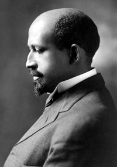
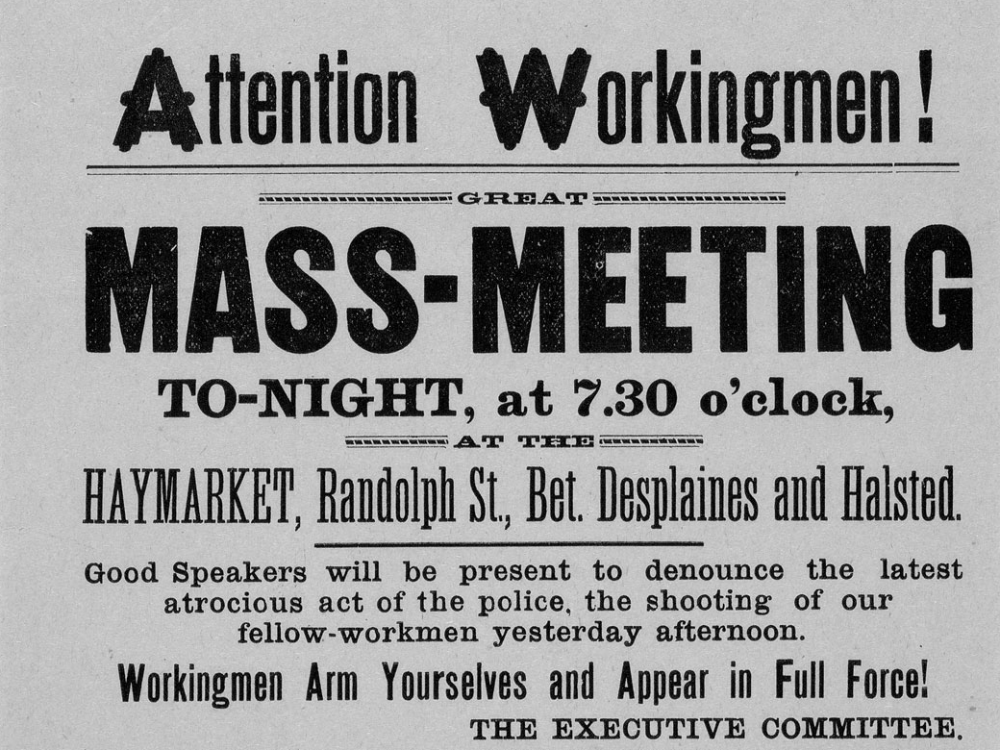

Text can be **bold**, _italic_, or ~~strikethrough~~.

[Link to another page](another-page).

There should be whitespace between paragraphs.

There should be whitespace between paragraphs. We recommend including a README, or a file with information about your project.

# Header 1

This is a normal paragraph following a header. GitHub is a code hosting platform for version control and collaboration. It lets you and others work together on projects from anywhere.

## Header 2

> This is a blockquote following a header.
>
> When something is important enough, you do it even if the odds are not in your favor.

### Header 3

Use tiles to style your collections.



#### Header 4

*   This is an unordered list following a header.
*   This is an unordered list following a header.
*   This is an unordered list following a header.

##### Header 5

1.  This is an ordered list following a header.
2.  This is an ordered list following a header.
3.  This is an ordered list following a header.

###### Header 6

| head1        | head two            | three |
|:-------------|:--------------------|:------|
| ok           | good social justice | nice  |
| out of stock | good and plenty     | nice  |
| ok           | good `oreos`        | hmm   |
| ok           | good `zoute` drop   | yumm  |

### There's a horizontal rule below this.

* * *

### Here is an unordered list:

*   Item foo
*   Item bar
*   Item baz
*   Item zip

### And an ordered list:

1.  Item one
1.  Item two
1.  Item three
1.  Item four

### And a nested list:

- level 1 item
  - level 2 item
  - level 2 item
    - level 3 item
    - level 3 item
- level 1 item
  - level 2 item
  - level 2 item
  - level 2 item
- level 1 item
  - level 2 item
  - level 2 item
- level 1 item

### Small image

### Large image

### Definition lists can be used with HTML syntax.

<dl>
<dt>Name</dt>
<dd>William</dd>
<dt>Born</dt>
<dd>1868</dd>
<dt>Birthplace</dt>
<dd>Massachusetts</dd>
<dt>Color</dt>
<dd>Red</dd>
</dl>

### Load events from a public Teamup calendar.



### Buttons are more prominent than links.




